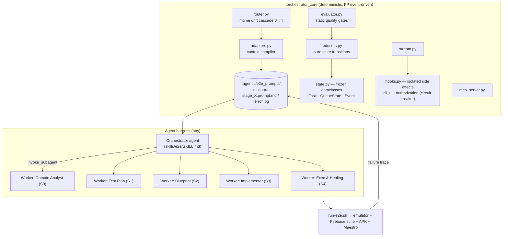

# Technical Specification — `agentic-e2e-test-workflow` v3.0 (As-Built Reconciliation)

> **Status:** DRAFT v3.0 — reconciled against the actual repository (master @ 2026-07-02, plugin v0.1.0, CHANGELOG 2026-06-27). Supersedes v2.1; per Data Retention, v1/v2.1 are retained — deltas are catalogued in §9, not erased.
> **Owner:** Théo (Monolith INC)
> **Repo:** `theocarranza/agentic-e2e-test-workflow` (now public, cloned and audited)
> **Execution note:** Plan/review artifact. Implementation Lock applies — findings in §10 are proposals, not applied changes.

---

## Codex Context

| Anchor | Role |
|---|---|
| Repo `master` (cloned): `README.md`, `CHANGELOG.md` v0.1.0 | Authoritative as-built description |
| `maestro-e2e-plugin/orchestrator_core/*.py` (832 LOC) | Runtime: state machine, router, adapters, evaluator, hooks, MCP server |
| `orchestrator_core/prompts/0–4 + orchestrator.prompt.md + gherkin-pt-br.md` | Stage prompt chain (pt-BR), incl. Stage 4 Execution & Self-Healing |
| `bootstrap.py`, `.claude-plugin/` + `.codex-plugin/` manifests | Multi-harness installer (Antigravity, AI Codex, Claude Code) |
| `reference/` | Aplicatudo golden artifacts (attendance module), `config.yaml`, skill-package `manifest.json` exemplar |
| `reference/topic-…multi-model-adapters…md` | Design intent: middleware dialect-translation pipeline (Gemini session, 2026-06-27) |
| Spec v1.0 / v2.1 | Prior contract set; carried items marked ⏩, superseded items marked Δ in §9 |

---

## 1. System Overview (As Built)

The plugin is **not** a prompt-only chain. It is a hybrid: a deterministic **Python orchestrator** (functional, event-driven) that routes work, compiles context, and gates quality — paired with **LLM worker sub-agents** that author the artifacts. Harness-agnosticism is achieved not by per-host prompt packages (v2.1's model) but by a **filesystem mailbox**: the engine writes compiled prompts to `.agentic/e2e_prompts/stage_X.prompt.md`; any agent (Antigravity, Claude Code, AI Codex) picks them up; failures return as `stage_X.error.log`, triggering self-healing `correcao` runs.



### 1.1 The five stages

| Stage | Worker | Artifact (router contract) | Gate (evaluator.py) |
|---|---|---|---|
| 0 Domain Discovery (adversarial; reads Dart source) | `domain_discovery` | `modules/{m}/domain.md` | 4 required `##` sections |
| 1 Test Plan (BDD/Gherkin, pt-BR via `gherkin-pt-br.md`) | `test_plan_author` | `scenarios/{f}/test-plan.md` | gherkin block, Feature/Funcionalidade, Scenario/Cenário, Implementation Notes |
| 2 Widget Blueprint | `widget_blueprint` | `scenarios/{f}/blueprint.md` | elements table header, Consolidated Semantics section |
| 3 Maestro Implementer | `maestro_implementer` | `scenarios/{f}/{f}.flow.yaml` | `appId:`, lifecycle subflow (`launch_clean` / `start_authenticated_session`) |
| 4 Execution & Self-Healing (device run, `maestro hierarchy` debug, auto-fix, learnings → `common-pitfalls.md`) | `execution_and_healing` | `scenarios/{f}/execution-report.md` | title + `**Status**: [PASS \| HEALED \| FATAL]` |

## 2. Goals (revised to as-built intent)

1. **Autonomous artifact pipeline** — router detects the first missing/stale/failed artifact and dispatches exactly one task; repeated invocation converges the workspace to a fully green 0→4 chain.
2. **Harness-agnosticism via mailbox** — any local agent that can read/write files can drive the pipeline; no per-host prompt forks (⏩ supersedes v2.1's build-generated host packages).
3. **Self-healing execution** — physical Maestro failures are captured, routed back as `correcao` tasks, and resolved learnings accrete in `common-pitfalls.md` (additive — Data Retention compatible).
4. **Deterministic quality gating** — every stage passes a static evaluator before advancing; critiques cascade back to the worker (Reflection Loop) up to `max_retries=3`.
5. **Governed autonomy** — the circuit breaker (`BLOCKED_REQUIRES_REVIEW`) halts on repeated failure and resumes only on the literal token `IMPLEMENTATION APPROVED` (the Implementation Lock, enforced in the runtime).
6. **Hermetic portability** — `--init` ejects bash infra + prompt templates into the target repo; project-local prompts in `e2e_test/prompts/` override plugin prompts (customization without forking).

## 3. Non-Goals

- **Per-model dialect middleware (yet)** — the multi-model adapter middleware from the design doc (dialect translation, tool-binding translation, protocol normalization) is design intent, not implemented; the mailbox is the v0.1.0 interoperability layer. Tracked as P2.
- **Non-Flutter/Maestro harnesses** — the engine hard-codes Dart globbing and Maestro artifacts in v0.1.0; a second harness remains architectural insurance.
- **Seed authoring** — unchanged from v1/v2.
- **CI orchestration beyond ejected scripts** — `run-e2e.sh` + libs are the CI surface; pipeline scheduling is out of scope.

## 4. Repository Layout (Actual)

```
agentic-e2e-test-workflow/
├── .claude-plugin/marketplace.json        # plugin: maestro-e2e-workflow v0.1.0
├── .codex-plugin/marketplace.json         # mirror manifest for AI Codex harness
├── README.md · CHANGELOG.md
├── orchestrator_core/                     # ⚠ root copy — DIVERGED from plugin copy (§10-F2)
├── maestro-e2e-plugin/
│   ├── plugin.json                        # interface manifest (displayName, capabilities)
│   ├── .claude-plugin/plugin.json · .codex-plugin/plugin.json
│   ├── bootstrap.py                       # --target all-agents → Antigravity (~/.gemini/config/plugins),
│   │                                      #   AI Codex (~/.codex-plugins), Claude (~/.claude/plugins/cache/local + registry)
│   ├── orchestrator_core/                 # canonical engine + prompts/
│   │   └── prompts/ 0…3, 4-e2e-quality-control, 4-execution-and-healing, orchestrator, gherkin-pt-br
│   ├── skills/e2e/SKILL.md                # Orchestrator-Worker loop (/e2e start · /e2e resume)
│   ├── scripts/ + scripts/e2e/            # ⚠ duplicated bash libs (§10-F3)
│   ├── e2e_test/modules/attendance/       # sample workspace
│   └── .agentic/e2e_prompts/              # mailbox (stage_0.prompt.md committed as sample)
└── reference/                             # Aplicatudo golden: prompts, attendance artifacts,
                                           #   config.yaml, manifest.json (skill-package contract exemplar),
                                           #   multi-model-adapter design doc
```

## 5. Runtime Contracts (Observed)

### 5.1 State machine
- **Immutable state:** `@dataclass(frozen=True)` throughout; transitions via `dataclasses.replace` in pure reducers; side effects isolated to subscribed hooks. (Conforms to the FP mandate at the architecture level. ✔)
- **Task states:** `READY → IN_PROGRESS → COMPLETED | BLOCKED | BLOCKED_REQUIRES_REVIEW`.
- **Dependency resolution:** completing a task promotes `BLOCKED` downstream tasks whose dependencies are all `COMPLETED` back to `READY`.
- **Circuit breaker:** `retry_count ≥ max_retries (3)` ⇒ `BLOCKED_REQUIRES_REVIEW`; `authorization_hook` resumes only on exact token `IMPLEMENTATION APPROVED` (dispatches `AuthorizationReceivedEvent`).

### 5.2 Routing / invalidation
- Drift detection is **mtime-cascade**: for each stage 0→4 in order — missing artifact ⇒ `novo`; `stage_X.error.log` present ⇒ `correcao`; `mtime(stage_N) < mtime(stage_N−1)` ⇒ `atualizacao`. First hit wins; one task per run.
- Missing `--flow` after Stage 0 ⇒ `RequireFlowSelectionEvent` (human-in-the-loop pause).
- Modes enum: `novo · atualizacao · resume · extend` (+ dispatched `correcao`).
- ⏩ This resolves v1/v2's open "seed/artifact invalidation" question at the artifact level: **freshness is mtime-transitive down the chain.**

### 5.3 Mailbox contract
- Engine → agent: `.agentic/e2e_prompts/stage_X.prompt.md` = `<system_instructions>` (stage prompt, project-override-aware) + `<execution_context>` (mode, target, upstream artifacts, and for S0 the module's Dart source via recursive glob `lib/**/*{module}*/**/*.dart`).
- Agent/gate → engine: `stage_X.error.log` = quality-gate critiques or Maestro stack trace; presence alone triggers `correcao` with the failed artifact + error embedded in the next compiled prompt.
- Rationale (CHANGELOG): file-based mailbox bypasses CLI character limits across harnesses.

### 5.4 Orchestrator-Worker protocol (SKILL.md)
1. Run `maestro-e2e --module <m>` (router + context compile). 2. Orchestrator MUST NOT author artifacts; it spawns a worker sub-agent with the compiled prompt. 3. `maestro-e2e evaluate --stage … --file …`; critiques → `send_message` back to worker; empty ⇒ advance. Matches the sub-agent token-optimization strategy from the design doc.

### 5.5 Execution layer (Stage 4)
- Entry: `bash e2e_test/scripts/e2e/run-e2e.sh` (emulator reuse/start, Firebase Local Emulator Suite, APK flavor install, Maestro run — lib-{apk,emulator,firebase,maestro,preflight,teardown,common}.sh).
- Failure loop: read trace → `maestro hierarchy` debug → patch `.flow.yaml` → re-run; converged learnings catalogued in workspace-root `common-pitfalls.md`.
- Report: `execution-report.md` with `**Status**: [PASS | HEALED | FATAL]`.
- Suite composition (`config.yaml`): glob `modules/**/*.flow.yaml`; composed scenarios tagged `composed` and excluded from independent runs; `executionOrder` = independent flows first, `full_journey` last, `continueOnFailure: true`; breakpoint tags `small/medium/large` selected via runner flags (⏩ v1 breakpoint contract, operationalized).

### 5.6 Carried v1 contracts still visible in golden artifacts ⏩
Directory shape `e2e_test/modules/{m}/…` (now enforced in code by `router.get_artifact_path` — note: **relative** `e2e_test/` root, superseding v1's full-path prose rule at the engine level); subflow composition via `runFlow`; lifecycle subflows (`launch_clean`, `start_authenticated_session`, `select_profile`, `select_student`); pt-BR Gherkin.

## 6. Multi-Harness Distribution (Actual Mechanism)

| Target | Install path (bootstrap.py) | Notes |
|---|---|---|
| Antigravity | `~/.gemini/config/plugins/maestro-e2e-workflow` | full copytree |
| AI Codex harness | `~/.codex-plugins/maestro-e2e-workflow` | full copytree |
| Claude Code | `~/.claude/plugins/cache/local/{name}/{version}` + `installed_plugins.json` registry entry | copies `skills/` + `orchestrator_core/`, writes cleaned manifest |
| Cursor | — | not in v0.1.0 (was in scope per your earlier direction — §11 OQ) |

Δ v2.1's "hosts reference core / build-generated packages" rule is superseded: distribution is **copy-install of one canonical package**, and runtime interop is the mailbox. Single-source-of-truth risk therefore shifts from prompt forks to **in-repo duplicate copies** (§10-F2/F3).

## 7. Acceptance Criteria (v3)

**AC-1 — Router convergence:** Given an empty module workspace, When `maestro-e2e --module m --flow f` is invoked repeatedly with each dispatched stage completed correctly, Then stages are dispatched strictly 0→4 with `novo` mode and a final run reports the pipeline complete.
**AC-2 — Staleness cascade:** Given a green chain, When `domain.md` is touched, Then the next run dispatches `stage_1` in `atualizacao` (and transitively 2→4 on subsequent runs).
**AC-3 — Correction priority:** Given `stage_2.error.log` exists and `stage_2` artifact is stale, When routed, Then mode is `correcao` (error takes precedence) and the compiled prompt embeds both the failed artifact and the error log.
**AC-4 — Gate cascade:** Given a stage artifact violating its evaluator checks, When evaluated, Then critiques are returned, the reducer requeues with `retry_count+1`, and the 3rd consecutive failure yields `BLOCKED_REQUIRES_REVIEW`.
**AC-5 — Implementation Lock:** Given `BLOCKED_REQUIRES_REVIEW`, When any input other than the exact token `IMPLEMENTATION APPROVED` is provided, Then the task remains blocked; the exact token dispatches `AuthorizationReceivedEvent`.
**AC-6 — Prompt override:** Given `e2e_test/prompts/1-test-plan-author.prompt.md` exists in the project, When stage_1 context is compiled, Then the project file is used instead of the plugin's.
**AC-7 — Stage-4 dispatchability:** Given stages 0–3 green, When the router dispatches `stage_4`, Then a stage-4 prompt is compiled to the mailbox without error. **(Currently FAILS — §10-F1.)**
**AC-8 — Copy integrity:** Given the repo, When root `orchestrator_core/` is diffed against `maestro-e2e-plugin/orchestrator_core/`, Then zero divergence (or the root copy is removed/derived). **(Currently FAILS — §10-F2.)**
**AC-9 — Suite composition:** Given `config.yaml`, When the suite runs, Then `composed`-tagged flows execute only inside `full_journey`, and execution order is independent-flows-first with `continueOnFailure`.
**AC-10 — FP conformance (engine):** state objects remain frozen; reducers pure; side effects only in hooks; no imperative mutation of shared state outside `replace`.

## 8. Success Metrics

- Pipeline convergence: 100% of AC-1 runs reach green 0→4 on the attendance golden module.
- Self-healing efficacy: ≥ 70% of injected Stage-4 selector failures resolved to `HEALED` without human input; 0 silent `FATAL`s.
- Governance: 0 resumes without the exact authorization token.
- Drift: 0 diverged duplicate files in-repo (AC-8).

## 9. Reconciliation Ledger (spec ⇄ as-built)

| Topic | v2.1 spec said | As built | Verdict |
|---|---|---|---|
| Core nature | prompt-package ("skills ARE the core") | Python runtime + prompts | Δ superseded — runtime is the core |
| Host adapters | build-generated per-host packages | mailbox + bootstrap copy-install | Δ superseded |
| Stage count | 4 + QC | 5 (S4 = execution & healing) + static evaluator gates | Δ extended |
| QC gate | LLM prompt w/ 8 pillars | `evaluator.py` static checks + `4-e2e-quality-control.prompt.md` (role ambiguous — §10-F5) | partial ⏩ |
| Binding manifest | JSON per archetype convention | not present; customization = prompt ejection + `config.yaml`; `reference/manifest.json` is a skill-package contract exemplar | Δ open (§11) |
| Implementation Lock | host hook (PreToolUse) | runtime circuit breaker + token | ⏩ strengthened |
| Invalidation | seed-version bump rule (open) | mtime cascade | ⏩ resolved (artifact level) |
| Directory contract | full-path form mandated | engine-relative `e2e_test/` root | Δ relaxed by code |
| pt-BR vs English | leaned English core | prompts pt-BR, engine/docs English, evaluator bilingual | Δ hybrid (fragile — §10-F6) |

## 10. Findings (review — proposals only, not applied)

- **F1 · BUG (blocking AC-7):** `adapters.get_stage_prompt_file` maps only `stage_0–3`; `router.resolve_routing` dispatches `stage_4` ⇒ `ValueError: Unknown stage: stage_4` when compiling S4 context. Fix: add `"stage_4": "4-execution-and-healing.prompt.md"` (and decide F5).
- **F2 · DRIFT (blocking AC-8):** root `orchestrator_core/` vs plugin copy — `adapters/evaluator/executor/main/router.py` all differ. One must become canonical; the other removed or generated. (Root copy also lacks `prompts/` and `init_scaffold.py`.)
- **F3 · DUP:** `scripts/lib-*.sh` duplicated at `scripts/` and `scripts/e2e/` inside the plugin.
- **F4 · HYGIENE:** `__pycache__/*.pyc` committed (both copies). Add `.gitignore`.
- **F5 · AMBIGUITY:** two stage-4 prompts (`4-e2e-quality-control` vs `4-execution-and-healing`); `main.py` binds `stage_4 → execution_and_healing`; the QC prompt is currently unrouted. Decide: fold QC into evaluator/S4, or make it a distinct gate stage.
- **F6 · FRAGILITY:** evaluator gates are literal string matches with parallel en/pt variants (e.g. table-header exact match) — brittle against benign formatting drift; consider structural checks (regex/AST/markdown parse).
- **F7 · CONTEXT RISK:** S0 fallback sweeps **entire `lib/`** when the module glob misses — token blowup on large repos; prefer fail-fast + `RequireModulePathEvent`.
- **F8 · PLACEHOLDER:** S2 context injects `[Widget tree diagnostic placeholder]` — blueprint quality currently rides on the prompt alone.
- **F9 · METADATA:** `plugin.json` author is `"developer"`; three plugin manifests (root, `.claude-plugin`, `.codex-plugin`) risk version skew — generate from one source.
- **F10 · BUG (confirmed):** nothing deletes `stage_X.error.log` — `executor.py` only writes prompts, `mcp_server.py` doesn't touch the mailbox, and SKILL.md never instructs the agent to clear it. Since the router prioritizes `error.log` presence over everything, a once-failed stage loops `correcao` forever even after being fixed. Fix: clear the log on evaluator PASS (engine-side, in the evaluate path) — agent-side cleanup would be unreliable.

## 11. Open Questions

- **[Design — blocking]** F5: fate of the unrouted QC prompt.
- **[Design]** Project binding: keep "ejected prompts + config.yaml" as the customization surface, or introduce the JSON binding manifest (v2.1) for vocabulary lock/seed anchor — which the engine currently does not enforce at all (the golden artifacts carry them only by convention)?
- **[Scope]** Cursor support: bootstrap targets Antigravity/Codex/Claude only. Still in scope?
- **[Roadmap — P2]** Multi-model dialect middleware from the design doc: layer it into `adapters.py` (pure `toAnthropicDialect`/`toGeminiDialect` formatters) or keep mailbox-only?
